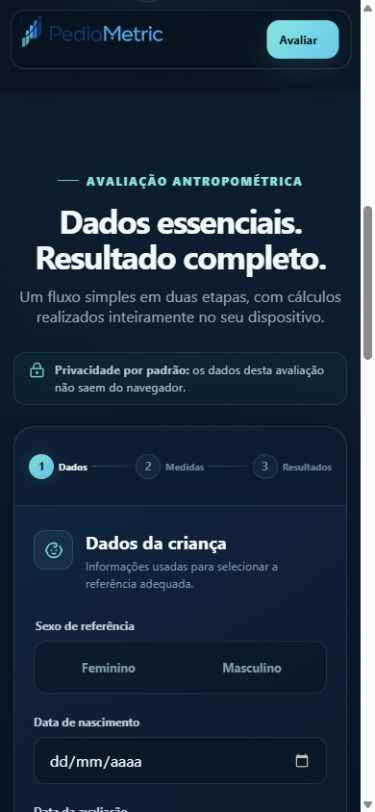
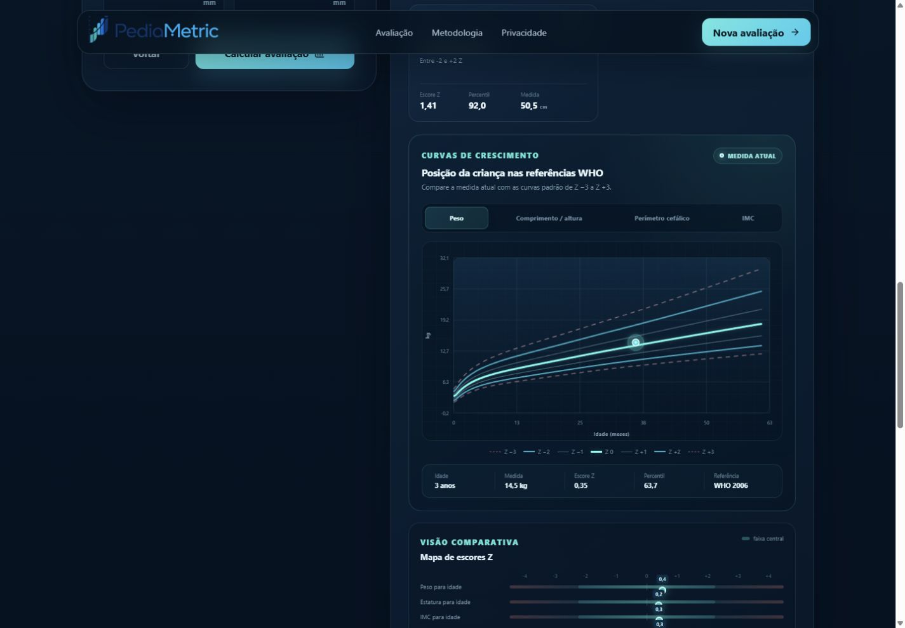

# PediaMetric

[](https://github.com/deyvidmathias/PediaMetric/actions/workflows/core-ci.yml)

Aplicação web de antropometria pediátrica baseada nas referências oficiais WHO Child Growth Standards 2006 e WHO Growth Reference 2007. O cálculo acontece localmente no navegador: não há conta, backend, telemetria clínica ou persistência automática das medidas informadas.

**Aplicação publicada:** [pediametric.netlify.app](https://pediametric.netlify.app/) · **Release atual:** [v0.1.0](https://github.com/deyvidmathias/PediaMetric/releases/tag/v0.1.0)

## Interface


<p align="center">
  
</p>



## Estrutura

- **PediaMetric Core:** cálculos, idade, IMC, LMS, escores Z, percentis, classificações, plausibilidade e séries das curvas de crescimento. Não depende da interface nem de uma implementação concreta dos dados.
- **WHO Data:** 12 tabelas versionadas, manifesto de hashes, fontes oficiais e importador reproduzível.
- **Validation:** regressões oficiais, casos extremos, privacidade e testes das fronteiras arquiteturais.
- **PediaMetric Web:** interface React responsiva com gráficos para peso, comprimento-altura, perímetro cefálico e IMC, consumindo exclusivamente a fachada pública do módulo antropométrico.

O Core recebe as referências por `LmsDatasetProvider`. A fachada `src/features/anthropometry/index.ts` conecta o Core aos dados WHO e preserva a chamada simples `assessAnthropometry(input)`. A Web carrega esse conjunto sob demanda apenas quando o usuário solicita o cálculo.

## Execução local

Os dados WHO não são armazenados neste repositório. Antes do primeiro build,
revise [THIRD_PARTY_NOTICES.md](./THIRD_PARTY_NOTICES.md), instale Python 3.11+
e prepare as fontes oficiais localmente:

```text
pnpm install
python -m venv .venv
.venv/Scripts/python -m pip install -r scripts/requirements-import.txt
pnpm run data:prepare
pnpm run dev
```

Em Linux/macOS, use `.venv/bin/python` no comando de instalação.

O endereço local padrão é `http://127.0.0.1:4173`.

## Verificação

```text
pnpm run verify
pnpm run build
```

`verify` executa TypeScript estrito e todos os testes automatizados. `build` também gera a versão otimizada da interface em `dist/`.

## Documentação

- produto e limites: `docs/PRODUCT.md`;
- arquitetura: `docs/ARCHITECTURE.md`;
- sistema visual: `docs/DESIGN.md`;
- estado atual: `docs/STATUS.md`;
- validação da Web: `docs/VALIDATION_WEB.md`;
- fontes e validação clínica: `docs/anthropometry/`.
- licença e materiais de terceiros: `LICENSE` e `THIRD_PARTY_NOTICES.md`.

O código original do repositório é disponibilizado sob MIT. Arquivos-fonte WHO
e tabelas LMS geradas permanecem fora do Git e sujeitos aos termos próprios da
organização. Nenhum pacote npm foi publicado.

## Preparação open source

`packages/core` contém uma preparação local e privada de `@pediametric/core`, compilada diretamente da fonte usada pela Web e sem incluir WHO Data. Para validar esse artefato:

```text
pnpm run verify:core
```

O comando compila ESM e declarações TypeScript, testa a API por self-import, inspeciona dependências proibidas e executa um dry-run do pacote. Consulte `docs/open-source/` antes de qualquer publicação. A licença MIT do Core não cobre tabelas, publicações, nomes ou marcas WHO.
